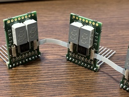

## BreadV PCBs

---------
| PCB           | Description                | Status        | Image                          |
|---------------|----------------------------|---------------|--------------------------------|
| ALU           | RiscV ALU                  | Scratch       |                                |
| CSR           | CSR controller             | Scratch       |                                |
| Reg           | 32bit register             | Scratch       |                                |
| ucode breaker | ucode eeprom breakout      | Scratch       |                                |
| Power         | Voltage regulator breakout | Done / In-use |                                |
| 8view         | 8bit bus bin/hex viewer    | Done / In-use |  |
| 8view-out     | 8view ffc breakout         | Done / In-use |                                |

